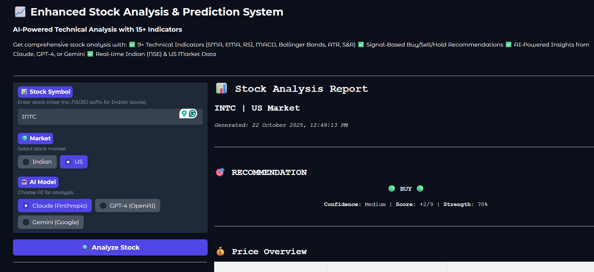
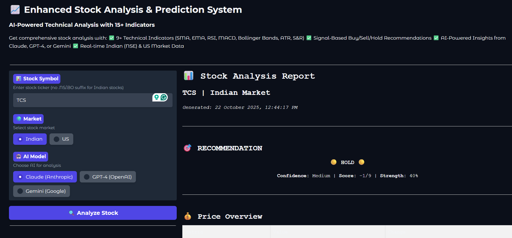
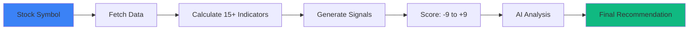

<div align="center">

# 📈 StockSense AI

### *AI-Powered Technical Analysis That Makes Sense*

**15 Indicators • 3 AI Models • Infinite Insights**

[](https://www.python.org/)
[](https://gradio.app/)
[](LICENSE)
[](https://github.com/udayslathia16/stocksense-ai)

---

*Making complex technical analysis simple and accessible for everyone.*

</div>

---

## 🌟 What is StockSense AI?

**StockSense AI** is an intelligent stock analysis platform that combines **15+ technical indicators** with **cutting-edge AI models** (Claude, GPT-4, Gemini) to provide clear, actionable trading insights for both Indian (NSE) and US markets.

### ✨ Why StockSense AI?

- 🧠 **Smart Analysis**: Multiple indicators working together, not in isolation
- 🤖 **AI-Enhanced**: Human-like reasoning on top of mathematical precision
- 🌍 **Multi-Market**: Support for both NSE (India) and US stocks
- 📊 **Comprehensive**: From moving averages to Bollinger Bands, we've got it all
- 🎯 **Actionable**: Clear BUY/SELL/HOLD recommendations with entry/exit points
- 🆓 **Free & Open Source**: No hidden costs, fully transparent

---

## 🎯 Key Features

### 📊 **Technical Analysis Suite**

<table>
<tr>
<td width="50%">

#### Trend Indicators
- ✅ Simple Moving Averages (SMA 20/50/200)
- ✅ Exponential Moving Averages (EMA 12/26)
- ✅ Golden Cross & Death Cross detection

</td>
<td width="50%">

#### Momentum Indicators
- ✅ RSI (Relative Strength Index)
- ✅ MACD (Moving Average Convergence Divergence)
- ✅ Overbought/Oversold detection

</td>
</tr>
<tr>
<td>

#### Volatility Indicators
- ✅ Bollinger Bands (20-day, 2σ)
- ✅ ATR (Average True Range)
- ✅ Risk assessment

</td>
<td>

#### Support & Volume
- ✅ Pivot Point Support/Resistance
- ✅ Volume Analysis & Ratios
- ✅ Price action confirmation

</td>
</tr>
</table>

### 🤖 **AI-Powered Insights**

| AI Model | Strengths | Use Case |
|----------|-----------|----------|
| **Claude Sonnet 4.5** | Nuanced analysis, context-aware | Deep market understanding |
| **GPT-4** | Comprehensive reasoning | Detailed trade strategies |
| **Gemini Pro** | Fast processing, free tier | Quick analysis |

### 🌍 **Multi-Market Support**

- **🇮🇳 Indian Stocks (NSE)**: Real-time data, circuit limits, delivery %
- **🇺🇸 US Stocks**: Full historical data, all 15+ indicators
- **⚡ Live Updates**: Current prices and market movements

---

## 🚀 Quick Start

### Prerequisites

- Python 3.8+
- API keys (free tier available for all)

### Installation (3 minutes)
```bash
# 1. Clone repository
git clone https://github.com/yourusername/stocksense-ai.git
cd stocksense-ai

# 2. Create virtual environment
python -m venv venv
source venv/bin/activate  # Windows: venv\Scripts\activate

# 3. Install dependencies
pip install -r requirements.txt

# 4. Configure API keys
cp .env.example .env
# Edit .env with your API keys

# 5. Run StockSense AI
python main.py
```

🎉 Open browser at `http://localhost:7860`

---

## 📊 Demo


### US Stock Analysis (INTC)
<details>
<summary>📈 Click to see full analysis output</summary>
    

```
🎯 RECOMMENDATION: BUY 🟢
Confidence: MEDIUM | Score: +2/9 | Strength: 70%

💰 Current Price: $38.12 (+0.0525%)

📊 Technical Indicators:
✓ Price above SMA-20 & SMA-50 (Bullish trend)
✓ RSI: 60.62 (neutral, room to grow)
✓ MACD: bearish  crossover confirmed
✓ Bollinger: Middle zone (neutral)
✓ Volume: 0.69x average (low avg)

🤖 AI Analysis (Claude):
"Strong uptrend confirmed by multiple timeframes. 
Entry recommended on pullback to $37.74-38.05 support.
Target: $41.93 (+10%), Stop: $36.21 (-5%)"
```

</details>


### Indian Stock Analysis Example (TCS)

<details>
<summary>📊 Click to see available data</summary>
    
  
```
🎯 RECOMMENDATION: HOLD 🟡
Confidence: MEDIUM | Score: -1/9 | Strength:40%

💰 Current Price: ₹3000 (-0.50%)
📊 Available Data:
- Day Range: ₹2,996 - ₹3031.80
- 52W Range: ₹2866.60 → ₹4494.90
- VWAP: ₹3013.14
- Volume: 310,619 shares


🤖 AI Analysis (Claude):
" The market sentiment for TCS appears cautious. The stock is trading near the lower end of its daily range and has experienced a slight decline, indicating some selling pressure."


```

</details>

---

## 📖 Documentation

| Guide | Description |
|-------|-------------|
| [**🚀 Installation Guide**](docs/INSTALLATION.md) | Step-by-step setup instructions |
| [**🔑 API Setup Guide**](docs/API_SETUP.md) | Get and configure API keys |
| [**📊 Indicators Guide**](docs/INDICATORS_GUIDE.md) | Learn how each indicator works |
| [**🎯 Quick Reference**](docs/QUICK_REFERENCE.md) | Cheat sheet for traders |
| [**🔧 Troubleshooting**](docs/TROUBLESHOOTING.md) | Common issues and solutions |

---

## 🎓 Learning Resources

### New to Technical Analysis?

- 📖 [Understanding Technical Indicators](docs/INDICATORS_GUIDE.md#the-15-technical-indicators)
- 🎯 [How the Scoring System Works](docs/INDICATORS_GUIDE.md#scoring-recommendations)
- 💡 [Real Trading Examples](docs/INDICATORS_GUIDE.md#real-world-example)

### Popular Stock Symbols

**🇮🇳 Indian (NSE)**
```
TCS, RELIANCE, INFY, HDFCBANK, SBIN, 
ITC, TATAMOTORS, WIPRO, BHARTIARTL, ASIANPAINT
```

**🇺🇸 US Markets**
```
AAPL, TSLA, GOOGL, MSFT, AMZN, 
NVDA, META, NFLX, AMD, COIN
```

---

## 🏗️ How It Works


**The StockSense Advantage:**
1. 📊 **15+ indicators** analyzed simultaneously
2. 🤖 **3 AI models** for enhanced insights
3. 🎯 **Signal confirmation** reduces false positives
4. 📈 **Risk assessment** for every trade
5. 💡 **Entry/exit strategy** included

---

## 💎 Use Cases

### For Day Traders
- ✅ Quick signal generation
- ✅ Volume confirmation
- ✅ Intraday support/resistance

### For Swing Traders
- ✅ Multi-timeframe trend analysis
- ✅ Entry/exit point suggestions
- ✅ Risk/reward calculations

### For Long-Term Investors
- ✅ Trend strength assessment
- ✅ Optimal entry timing
- ✅ Position sizing guidance

### For Learning
- ✅ Understand indicator relationships
- ✅ See AI reasoning process
- ✅ Educational for beginners


---

## 🤝 Contributing

We love contributions! Here's how you can help:

### Ways to Contribute

- 🐛 **Report bugs** - Found an issue? Let us know!
- 💡 **Suggest features** - Have an idea? We're listening!
- 📝 **Improve docs** - Help others understand better
- 🔧 **Submit PRs** - Code contributions welcome!

### Contribution Guidelines

1. Fork the repository
2. Create your feature branch (`git checkout -b feature/AmazingFeature`)
3. Commit your changes (`git commit -m 'Add AmazingFeature'`)
4. Push to the branch (`git push origin feature/AmazingFeature`)
5. Open a Pull Request


---

## 📊 Project Stats

<div align="center">


</div>

---

## ⚠️ Disclaimer

> **IMPORTANT: Educational Use Only**

StockSense AI is designed for **educational and informational purposes only**.

- ❌ **NOT financial advice** - Always do your own research
- 📊 **Past performance ≠ future results** - Markets are unpredictable
- 💼 **Consult professionals** - Speak with licensed financial advisors
- ⚠️ **Risk awareness** - Trading involves substantial risk of loss
- 📉 **Capital risk** - Never invest more than you can afford to lose

**By using this software, you acknowledge that:**
- You understand the risks involved in trading
- You will not hold the authors liable for any financial losses
- You are responsible for your own trading decisions

**Trade responsibly. Invest wisely. Learn continuously.**

---

## 📝 License

This project is licensed under the **MIT License** - see the [LICENSE](LICENSE) file for details.

### What this means:
- ✅ Commercial use allowed
- ✅ Modification allowed
- ✅ Distribution allowed
- ✅ Private use allowed
- ℹ️ License and copyright notice required

---

## 🙏 Acknowledgments

### Technologies
- [Gradio](https://gradio.app/) - Beautiful UI framework
- [NSEPython](https://github.com/jugaad-py/jugaad-data) - Indian stock data
- [Alpha Vantage](https://www.alphavantage.co/) - US stock data

### AI Partners
- [Anthropic](https://www.anthropic.com/) - Claude AI
- [OpenAI](https://openai.com/) - GPT-4
- [Google AI](https://ai.google.dev/) - Gemini


---

## 📧 Contact & Support

<div align="center">

### Need Help?

[](https://github.com/udayslathia16/stocksense-ai/issues)
[](https://github.com/udayslathia16/stocksense-ai/discussions)
[](mailto:udayslathia16@gmail.com)

</div>

### Connect With Me

- 💼 **LinkedIn**: [Uday Slathia](https://linkedin.com/in/udayslathia)

---

## ⭐ Star History

If you find StockSense AI helpful, please consider giving it a star!

[](https://star-history.com/#udayslathia16/stocksense-ai&Date)

---

<div align="center">

### Made with ❤️ and ☕ by [Uday Slathia]

**StockSense AI** - *Making sense of stocks, one signal at a time.*

[⬆ Back to Top](#-stocksense-ai)

</div>